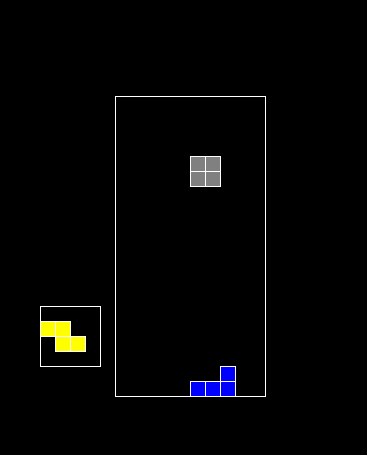

# Tetris
Projet des BA1 INFO 2017 - Tetris

### Démarrer
Pour lancer le programme il suffit d'exécuter
```
python3 Tetris.py
```

### Commandes
Pour déplacer les pièces utilisez les flèches gauches et droite.  Pour retourner une pièce pousser sur la flèche du haut.  Pour faire descendre une pièce directement tout en bas faites la flèche du bas.  Poussez sur `esc` pour mettre le jeu en pause.


### Images

